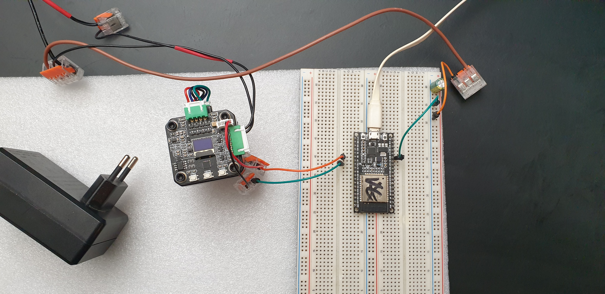
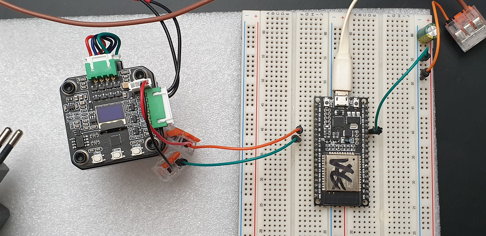

# About this library

This library is made to configure a Makerbase Servo42C in uart mode with the softest settings possible.
It uses the SERVO42C-ESP32WROOM32-UART library and will auto configure a connected driver after boot.

The default settings of the driver are very aggressive which does not fit my requirements. They rapidly increase torque on small error and keep increasing torque while the error gets larger.

Things this configuration does is change the max current and max torque and also adjust the PID.

With a small Nema17 as used in the example video it is possible to move the shaft with a finger and stop the return rotation with a soft touch.

This will not be of much use in a real load scenario but it is a starting point. Max current and max torque are values that need to be changed later to fit the specific setup. 
  

 
 

# Warning
This library does not support the v1.0 version and is written for the v1.1 version of the 42C board. 
Amazon and Ebay have a lot of S42C boards that are sold without stepper motor. All of them seem to be outdated versions
that will not work with this code. This one includes a stepper motor and ships with the v1.1 board. It is what I bought:
https://www.amazon.de/dp/B09MTXGVMZ

  
# Notes
This library uses UART2 mapped to GPIO16 as RX and GPIO0 as TX. Using UART1 on this board does not work without issues.

Flash it with vstudio code and platform.io (extension for vstudio code) 

The wiring is simple. it requires a 12v power supply like a wall charger, an ESP32 WROOM32 and some jumpers.  

The 12V +- is connected to the MKS 42C drivers V+ and GND input on the big terminal. The GND of the 12V PSU is also connected to the ESP GND. After that only RX/TX for UART are connected.  

ESP RX (GPIO16) -> MKS42C TX  
ESP TX (GPIO0)  -> MKS42C RX  

The 3.3v and GND pins on the little UART interface on the driver are not used.  

  
The motor needs to be calibrated with UART baud set to 115200 and mode set to UART. Everything else is done by the init script after the ESP boots up.

  
See the file /lib/mks42c/config.h for more details about the configuration. Change the values in that file as needed and reflash the firmware to write them on the driver.

